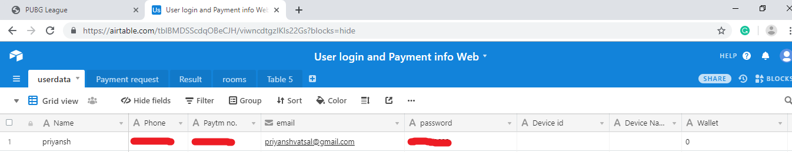
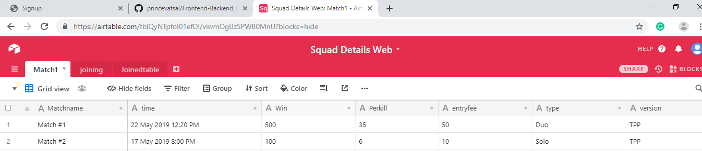

This is fully fleged website with <b>NodeJs</b> as Backend , <b>Login/SignUp</b> system using <b>JSON tokens</b>, and <b>Payment Integration </b> through Paytm API
 
And with a very <b>User Friendly Database Airtable</b>
 
Make an account on Airtabe And make 2 Base :-
	1 for Users Data
	2 for match Data
 
User Table Fields:-Name,Phone,Paytm no,email,password,Wallet,matchjoined,redeemed

 
Match Table Fields:-Matchname,time,Win,Perkill,entryfee,type,version,Ongoing,totaluser,matchId,room_username,room_password

 

Now Last Thing to do , 

Make a account on paytm for developer and copy MID and PAYTM_MERCHANT_KEY from there and Paste in <b>Paytm/config.js</b>